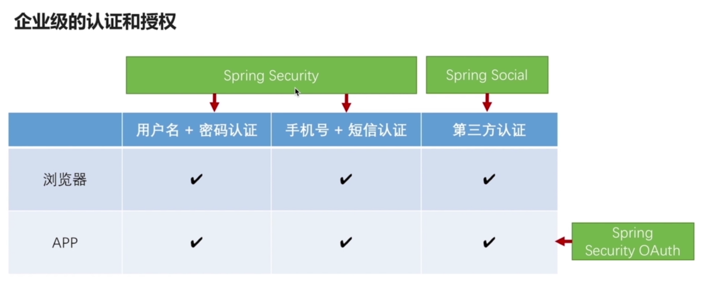

# 1-1 导学

## 安全 -> 认证和授权 -> 不就是登陆？

## 有一定经验的程序员如何提升自己

* 每天都很忙，但感觉水平没有提升
* 不知道学什么，遇到复杂业务场景时，又感觉技术储备不够
* 工作中写过很多代码，但是面试时几句话就说完了

## 讲一门聚焦的课

* 把一个知识点所有常见场景和特性都覆盖到
* 不止讲自己写的代码，还要讲框架的源码
* 不止要实现功能，还要封装起来能重用，能给别人用

## 企业级的认证和授权

* 支持多种认证方式

  * 用户名/密码
  * QQ登陆
  * 微信登陆
  * ...

* 支持多种前端渠道
  * 浏览器
  * APP

* 支持集群环境

  * 跨应用工作
  * SESSION控制
  * 控制用户权限
  * 防护与身份认证相关的攻击

## 课程目标

* 深入理解 Spring Security 及相关框架的远离、功能和代码
* 可以基于 Spring Security 及相关框架独立开发认证授权相关功能
* 掌握抽象和封装的常见技巧可以编写可重用的模块供他人使用

## 前置知识

* Java Web 基础
* Maven 基础
* Spring 基础

